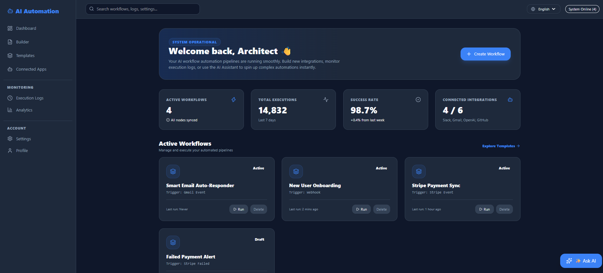
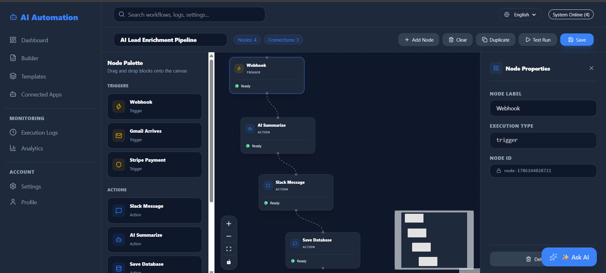
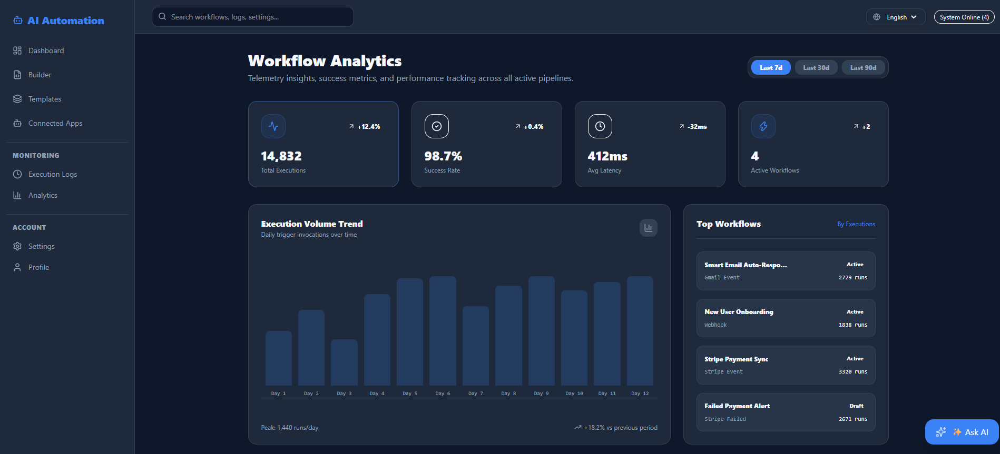
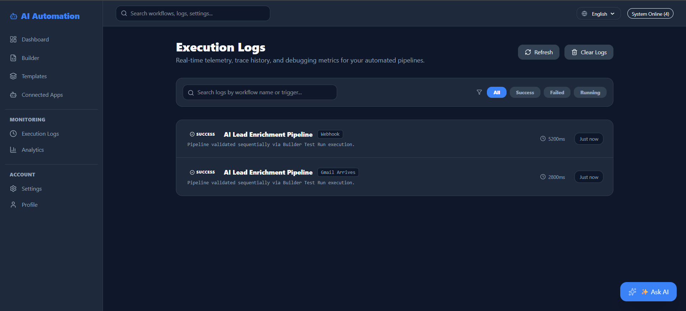

# 🚀 AI Workflow Automation Dashboard

A modern AI-powered Workflow Automation Dashboard inspired by **APPSeCONNECT**, **n8n**, **Zapier**, and **Make.com**.

This project allows users to visually build, manage, and monitor automation workflows using a drag-and-drop workflow builder.

---

## 📸 Screenshots

### Dashboard


### Workflow Builder


### Analytics


### Connected Apps


### Execution Logs


### Templates


# ✨ Features

- 📊 Interactive Dashboard
- 🔄 Visual Workflow Builder
- 🧩 Drag & Drop Nodes
- 🤖 AI Assistant
- 📁 Workflow Templates
- 📈 Analytics Dashboard
- 📜 Execution Logs
- 🔗 Connected Apps
- ⚙️ Settings
- 👤 User Profile
- 🌙 Dark Theme
- 💾 LocalStorage Persistence
- 📱 Responsive UI

---

# 🛠 Tech Stack

- React
- TypeScript
- Vite
- Tailwind CSS
- React Flow
- React Router
- Framer Motion
- Recharts
- Lucide React
- Context API
- LocalStorage

---

# 🏗 Folder Structure

```text
src/
│
├── components/
├── pages/
├── layouts/
├── context/
├── hooks/
├── services/
├── routes/
├── assets/
├── utils/
├── constants/
├── types/
└── data/
```

---

# 🚀 Core Modules

### Dashboard

- Workflow statistics
- Success rate
- Recent workflows
- Quick actions

### Workflow Builder

- Drag & Drop Nodes
- Node Properties
- Save Workflow
- Test Run
- Duplicate Workflow
- Clear Canvas

### Templates

Ready-to-use workflow templates.

### Connected Apps

- Slack
- Gmail
- GitHub
- Stripe
- OpenAI
- Database

### Analytics

Interactive charts using Recharts.

### Execution Logs

Real-time execution history.

### Settings

Persistent application preferences.

### Profile

Editable user profile stored locally.

---

# ⚡ Future Improvements

- Node.js Backend
- MongoDB
- JWT Authentication
- OAuth (Google, Slack, GitHub)
- Real AI Integration
- Webhooks
- Docker
- Team Collaboration
- Workflow Scheduling

---

# ▶️ Installation

```bash
git clone https://github.com/dev-adityap/ai-workflow-automation.git

cd ai-workflow-automation

npm install

npm run dev
```

---

# 👨‍💻 Author

**Aditya Panna**

Built with ❤️ using React + TypeScript.
